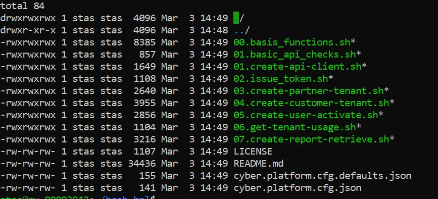
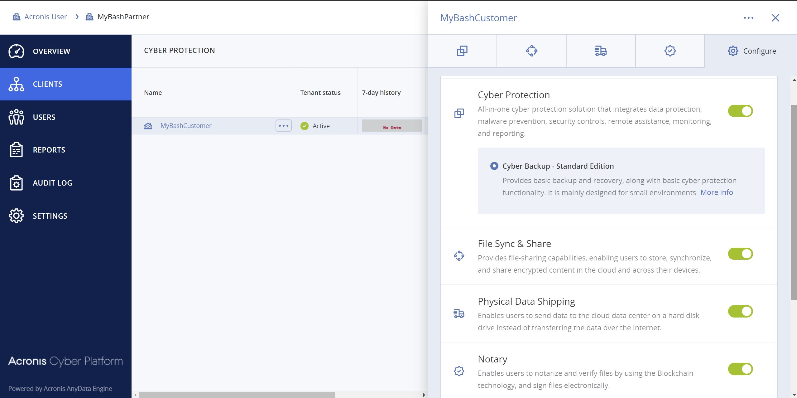
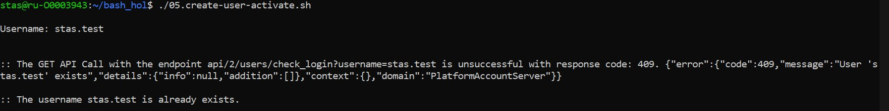

# Base Acronis Cyber Platform API operations with bash

!!! note The GitHub repository contains not only code for this Hans-on Lab but other advanced code examples. Please, check [Code Directory](#code-directory) for details.

[[TOC]]

## Code Directory

|File name       |File description
|-----------------------------------|--------------------------
|`00.basis_functions.sh`    |Contains code basis functions to call the API: `_get_api_call_basic`,`_get_api_call_bearer`,`_get_api_call_bearer_with_response_code`, `_post_api_call_basic`, `_post_api_call_bearer` and `_put_api_call_bearer` as well as other utility functions described at the end of the manual. It's included in each file except `01.basic_api_checks.sh`.
|`01.basic_api_checks.sh`    |Base sanity checks need to be performed before the API calls. It's included in each file except `00.basis_functions.sh`, `01.create-api-client.sh` and `02.issue_token.sh`.
|`01.create-api-client.sh`   |Creates an API Client (`client_id`, `client_secret`) to generate a JWT token and access the API. The Basic Authentication is used. For Acronis Cyber Protect (Acronis Cyber Cloud 9.0) the Management Console can be used to create an API Client. The result of the script is stored in clear text `api_client.json` file. It's raw answer from the API call. For your solutions, please, implement secured storage for `client_id`, `client_secret` as they are credentials to access the API. The scrip asks for login and password to create an API Client.
|`02.issue_token.sh`     |Issue a JWT token to access the API. The token is expired in 2 hours. During the sanity checks in `01.basic_api_checks.sh` an expiration time for the current token is checked and a token is reissued if needed. The result of the script is stored in clear text `api_token.json` file. It's raw answer from the API call. For your solutions, please, implement secured storage for a JWT token info as they are credentials to access the API.
|`03.create-partner-tenant.sh`  |Creates a partner with name _MyBashPartner_ and enables all available offering items dor them for an edition, specified in json configuration files `cyber.platform.cfg.json` and  `cyber.platform.cfg.defaults.json`.
|`04.create-customer-tenant.sh`  |Creates a customer for _MyBashPartner_ with name _MyBashCustomer_ and enables all available offering items dor them for an edition, specified in json configuration files `cyber.platform.cfg.json` and  `cyber.platform.cfg.defaults.json`.
|`05.create-user-for-customer-activate.sh`   |Creates a user for _MyBashCustomer_ and activate them by setting a password. The script asks for username to create.
|`06.get-tenant-usage.sh`    |Gets usage for the root tenant.
|`07.create-report-retrieve.sh`  |Create an one time report to dave for the root tenant, wait till its creation and download.
|`08.get-agent-installation-token.sh`|Create an Agent installation token for a user tenant.
|`09.agent-installation.sh`|A sample to installing the Agent installation with no user prompts with default settings using an Agent installation token to register at the Acronis Cyber Cloud.
|`10.get-all-agents-info.sh`|Get list of all Acronis Agents for tenants subtree where the root tenant is a tenant for which an API Client is created.
|`11.get-all-agents-info-for-customer.sh`|Get list of all Acronis Agents for tenants subtree where the root tenant is a previously created customer.
|`12.get-all-tasks-for-the-last-week.sh`|Get the list of all tasks competed during the last week.
|`13.get-all-activities-for-the-last-week.sh`|Get the list of all activities competed during the last week.
|`14.get-all-alerts-for-the-last-week.sh`|Get the list of all alerts competed during the last week.
|`15.get-all-tasks-with-pagination.sh`|Get the list of all tasks with pagination.
|`16.get-all-activities-with-pagination.sh`|Get the list of all activities with pagination.
|`17.get-all-alerts-with-pagination.sh`|Get the list of all alerts with pagination.
|`results`|The results of code-edition or code-writing exercises.
|`images`|The images for this guide.
|`pdf`|This guide rendered to PDF format.
|`LICENSE`       |The license for the code. It's MIT license.
|`README.md`       |This file.
|`cyber.platform.cfg.defaults.json` |Contains default configuration values for the scripts. They are used when the values are not defined in `cyber.platform.cfg.json` file.
|`cyber.platform.cfg.json`   |Contains configuration values for the scripts.

## The Acronis Cyber Platform API general workflow

|#|Operation|When/Period|Prerequisites / Inputs
|---|---|---|---
|1| Create an API client under which an integration will be authorized |Initially.<br/><br/>Periodically if security policies require your company to regenerate all passwords each X months.<br/><br/>Through the API or the Management Portal for ACC 9.0 and greater. |Login and password with a needed level of access in Acronis Cyber Cloud.<br/><br/>Usually, it's a service Admin account under your company’s Partner tenant in Acronis Cyber Cloud.
|2|Issue an access token|1. Before the first API Call which is not connected to the authorization flow<br/><br/>2. Each time when your token is near to be expired.|Your API Client credentials
|3|Make API calls||An access token issued using your API Client credentials

## Prerequisites and basis information

!!! note The GitHub repository contains not only code for this Hans-on Lab but other advanced code examples. Please, check [Code Directory](#code-directory) for details.

To access the API we use `curl` utility, to process JSON, we use `jq` utility. So, please, be sure that you have `curl` and `jq` available.

To simplify code basis functions to call the API have created: `_get_api_call_basic`,
`_get_api_call_bearer`, `_get_api_call_bearer_with_response_code`, `_post_api_call_basic`, `_post_api_call_bearer` and `_put_api_call_bearer` as well as other utility functions.

You can find descriptions and code at the end of the article.

To run the scripts, you need to edit or create the `cyber.platform.cfg.json` file to provide base parameters. At minimum you need to change `base_url` to your data center URL. The global variables `_base_url` initialized from the config file and used for all API requests. All other values can remain unchanged.
A `cyber.platform.cfg.json` file example:

```json
{
 "base_url": "https://dev-cloud.acronis.com/",
 "partner_tenant": "partner",
 "customer_tenant": "customer",
 "edition": "per_workload"
}
```

The API Call trace functionality is also available. By default, API calls are not traced as `trace` set to 0 in `cyber.platform.cfg.defaults.json` file, which you might create, but you can override it in `cyber.platform.cfg.json` file if you need it. As soon as its enabled you will see in `STDERR` `curl` API calls with all parameters as well as a raw response form the calls.

A `cyber.platform.cfg.defaults.json` file example:

```json
{
 "base_url": "https://dev-cloud.acronis.com/",
 "partner_tenant": "partner",
 "customer_tenant": "customer",
 "edition": "per_workload",
 "trace": 0
}
```

## Exercise 1: Create an API Client to access the API

### Implementation details

A JWT token with a limited time to life approach is used to securely manage access of any API clients, like our scripts, for the Acronis Cyber Cloud. Using a login and password for a specific user is not a secure and manageable way to create a token, but technically it's possible. Thus, we create an API client with a client id and a client secret to use as credentials to issue a JWT token.
To create an API Client, we call the `/clients` end-point with POST request specifying in the JSON body of the request a tenant we want to have access to. To authorize this the request, the Basic Authorization with user login and password for Acronis Cyber Cloud is used.

!!! note In Acronis Cyber Cloud 9.0 API Client credentials can be generated in the Management Portal.

!!! note Creating an API Client is a one-time process. As the API client is used to access the API, treat it as credentials and store securely. Also, do not store the login and password in the scripts itself.

In the following code block a login and a password are requested from a command line and use it for a Basic Authorization for following HTTP requests.

```bash
# Ask the user for login details
# To use for Basic Authentication
# To create an API Client
printf "\n"
read -rp 'Login: ' _login
read -rsp 'Password: ' _password
printf "\n\n"
```

In those scripts it is expected that the [Acronis Developer Sandbox](https://developer.acronis.com/sandbox/) is used. It is available for registered developers at [Acronis Developer Network Portal](https://developer.acronis.com/). So the base URL for all requests (https://devcloud.acronis.com/) is used. Please, replace it with correct URL for your production environment if needed. For more details, please, review the [Authenticating to the platform via the Python shell tutorial](https://developer.acronis.com/doc/platform/management/v2/#/http/developer-s-guide/authenticating-to-the-platform-via-the-python-shell) from the Acronis Cyber Platform documentation.

For demo purposes, this script issues an API client for a tenant for a user for whom a login and a password are specified. You should add your logic as to what tenant should be used for the API Client creation.

```bash
# Request self-ifo from API using Basic Authentication
# GET call using function defined in basis_functions.sh
# with following parameters
# $1 - an API endpoint to call
# $2 - a login for Basic Authentication
# $3 - a password for Basic Authentication
# The result is going to jq utility to extract JSON property
# Please NOTE, that this property is retrieved with quotas
_tenant_id=$(_get_api_call_basic "api/2/users/me" "${_login}" "${_password}" | jq '.tenant_id')

# Construct JSON to request an API Client creation
_json='{
  "type": "api_client",
  "tenant_id": '$_tenant_id',
  "token_endpoint_auth_method": "client_secret_basic",
  "data": {
    "client_name": "Acronis.GitHub.Bash.Examples"
    }
   }'
```

!!! note `client_name` value defines the name you will see in the ACC 9.0 Management Console. For real integrations, please, name it carefully to have a way to identify it in a future.

```bash
# To create an API Client
# GET call using function defined in basis_functions.sh
# with following parameters
# $1 - an API endpoint to call
# $2 - a login for Basic Authentication
# $3 - a password for Basic Authentication
# The result is stored in api_client.json file
_post_api_call_basic "api/2/clients" \
     "${_login}" "${_password}" \
     "${_json}" \
     "application/json" > api_client.json
```

!!! note A generated client is inherited access rights from a user used for the generation but it's disconnected from them. You don't need to issue a new client even if the user account is removed from Acronis Cloud.

!!! warning Treat API Clients as a specific service account with access to your cloud. All internal security policies applied to your normal account operations should be in place for API Clients. Thus, don't create new API Clients if you don't really required and disable/delete unused API Clients through the Management Console or API Calls.

!!! warning You can receive a `client_secret` only once, just at the issue time. If you loose your `client_secret` further you must reset secret for the client through the Management Console or API Calls. Please, be aware, that all the tokens will be invalidated.

!!! danger You need to securely store the received credentials. For simplicity of the demo code, a simple JSON format is used for `api_client.json` file. Please remember to implement secure storage for your client credentials.

### Step-by-step execution and checks

1. Open any available `bash` environment: Linux, Mac or Windows with Windows Subsystem for Linux.
2. Copy code directory to your local system and ensure that all `.sh` files are executable. Your directory listing should looks like bellow.

3. Edit  `cyber.platform.cfg.json` file to enter your `base_url` aka your data center URL for API calls. All other options remain unchanged.
4. Type `./01.c` and press `Tab`, it should autocomplete to the `./01.create-api-client.sh`.
5. Press `Enter`. You should see request for login. Type it and press `Enter`. You should see request for password. Type it and press `Enter`
6. If you enter login and password correctly, the script just makes a series of API calls silently and exit. If you make a mistake, you receive a detailed error description. For example, below a `401 Unauthorized` error, which means your login or/and password are incorrect.

7. Type `jq < api_client.json` and press `Enter`. You should see highlighted JSON file with an API Client information. If you can see something similar to picture bellow, you successfully created an API Client and can follow to the next exercise.


## Exercise 2: Issue a token to access the API

### Implementation details

A `client_id` and a `client_secret` can be used to access the API using the Basic Authorization but it's not a secure way as we discussed above. It's more secure to have a JWT token with limited life-time and implement a renew/refresh logic for that token.

To issue a token `/idp/token` end-point is called using `POST` request with param `grant_type` equal `client_credentials` and content type `application/x-www-form-urlencoded` with Basic Authorization using a `client_id` as a user name and a `client_secret` as a password.

```bash
# Pipe JSON from file, extract JSON property, remove quotas from the property's value
_client_id=$(jq '.client_id' < api_client.json | sed -e 's/^"//' -e 's/"$//')
_client_secret=$(jq '.client_secret' < api_client.json | sed -e 's/^"//' -e 's/"$//')

# To issue a token
# POST call using function defined in basis_functions.sh
# with following parameters
# $1 - an API endpoint to call
# $2 - a login for Basic Authentication
# $3 - a password for Basic Authentication
# $4 - POST data
# $5 - Content-Type
# The result is stored in api_token.json file
_post_api_call_basic "api/2/idp/token" \
     "${_client_id}" "${_client_secret}" \
     "grant_type=client_credentials" \
     "application/x-www-form-urlencoded" > api_token.json
```

!!! danger You need to securely store the received token. For simplicity of the demo code, the received JSON format is used `api_token.json` file. Please implement secure storage for your tokens.

!!! note A token has time-to-live and must be renewed/refreshed before expiration time. The best practice is to check before starting any API calls sequence and renew/refresh if needed.

!!! note Currently, the default time-to-live to a token for the API is 2 hours.

Assuming that the token is stored in the JSON response format as above, it can be done using the following functions set.

`expires_on` is a time when the token will expire in Unix time format -- seconds from January 1, 1970. Here we assume that we will renew/refresh a token 15 minutes before the expiration time.


```bash
# Issue an authorization token
# Expect that an API client information are stored
# in native API output format in api_client.json file
# $1 - base URL
_issue_token() {

  local _client_id
  local _client_secret

  # Pipe JSON from file, extract JSON property, remove trilling quotas from the property's value
  _client_id=$(jq '.client_id' < api_client.json | sed -e 's/^"//' -e 's/"$//')
  _client_secret=$(jq '.client_secret' < api_client.json | sed -e 's/^"//' -e 's/"$//')

  # POST call to issue an authorization token
  # To use it you need have the following parameters passed
  # $1 - an API endpoint to call
  # $2 - a login for Basic Authentication
  # $3 - a password for Basic Authentication
  # $4 - POST data
  # $5 - Content-Type
  _post_api_call_basic "api/2/idp/token" \
       "${_client_id}" "${_client_secret}" \
       "grant_type=client_credentials" \
       "application/x-www-form-urlencoded" > api_token.json
}


# Check if an authorization token in valid next 15 minutes (900 sec)
# And if it's not, a new token will be issued
# Expect that an authorization token information are stored
# in native API output format in api_token.json file
# Still works correctly if you didn't have a token file
_renew_token_if_needed() {

 local _expires_on
 local _current_unix_time
 local _time_left

 if test -f api_token.json; then
  # Pipe JSON from file, extract JSON property
  _expires_on=$(jq '.expires_on' < api_token.json)
  _current_unix_time=$(date +%s)
  _time_left=$_expires_on-$_current_unix_time
  if [[ $_time_left -le 900 ]] ; then
   _issue_token
  fi
 else
  _issue_token
 fi
}
```

### Step-by-step execution and checks

1. Type `./02` and press `Tab`, it should autocomplete to the `./02.issue_token.sh`.
2. Press `Enter`. If `api_client.json` file exists and contains correct information, the script just makes a series of API calls silently and exit. If you make a mistake, you receive a detailed error description.
3. Type `jq < api_token.json` and press `Enter`. You should see highlighted JSON file with a token information. If you can see something similar to picture bellow, you successfully issued a token and can follow to the next exercise.

4. Including `01.basic_api_checks.sh` file in each following scripts we ensure that a token will be reissued if needed before any API call.
5. Check `01.basic_api_checks.sh` file to verify that you can understand implementation details described above.

## Exercise 3: Create partner, customer and user tenants and set offering items

### Implementation details

So now we can securely access the Acronis Cyber Platform API calls. In this topic we discuss how to create a partner, a customer tenants and enable for them all available offering items, and then create a user for the customer and activate the user by setting a password.

As we discussed above, before making a call to the actual API you need to ensure that an authorization token is valid. Please, use the functions like those described above to do it.

Assuming that we create the API client for our root tenant, we start from retrieving the API Client tenant information using GET request to `/clients/${_client_id}` end-point. Then, using received `tenant_id` information as a parameter and `kind` equal to `partner`, we build a JSON body for POST request to `/tenants` end-point to create the partner. Next, we are going to enable all applications and offering items for the tenants.  Briefly, we take all available offering items for the parent tenant of the partner or the customer using
GET request to `/tenants/${_tenant_id}/offering_items/available_for_child` end-point with needed query parameters specifying `edition` and `kind` of the tenant. Then, we need to enable these offering items for the partner or the customer using PUT request to `/tenants/${_tenant_id}/offering_items` end-point with all offering items JSON in the request body and appropriate `_tenant_id`.

!!! note The following `kind` values are supported `root`, `partner`, `folder`, `customer`, `unit`.

```bash
# Call a function to pipe JSON from file, extract JSON property
_tenant_id=$(_get_tenant_id_from_file api_client.json)

# Construct JSON to request a partner tenant creation
_json='{
  "name": "MyBashPartner",
  "parent_id": "'$_tenant_id'",
  "kind": "partner"
 }'

# To create a partner tenant
# POST API call using function defined in basis_functions.sh
# with following parameters
# $1 - an API endpoint to call
# $2 - Content-Type
# $3 - POST data
# The result is stored in partner.json file
_post_api_call_bearer "api/2/tenants" \
     "application/json" \
     "${_json}" > partner.json

# Get Kind of a tenant from config file
_kind=$(_config_get_value partner_tenant)

# Get Edition we plan to enable from config file
_edition=$(_config_get_value edition)

# To get a list of offering ite,s available for a child tenant
# GET call using function defined in basis_functions.sh
# with following parameters
# $1 - an API endpoint to call
# The result is stored in offering_items_available_for_child.json file
_get_api_call_bearer "api/2/tenants/${_tenant_id}/offering_items/available_for_child?kind=${_kind}&edition=${_edition}" \
                    > offering_items_available_for_child.json


# Replace "items" with "offering_items" as the following API call expects to have it as a root JSON element
 sed 's/"items"/"offering_items"/g' < offering_items_available_for_child.json > offering_items_to_put.json


# Call a function to pipe JSON from file, extract JSON property
_partner_tenant_id=$(_get_id_from_file partner.json)

# To update offering item for a tenant
# PUT API call using function defined in basis_functions.sh
# with following parameters
# $1 - an API endpoint to call
# $2 - Content-Type
# $4 - PUT data
_put_api_call_bearer "api/2/tenants/${_partner_tenant_id}/offering_items" \
     "application/json" \
     "$(cat offering_items_to_put.json)" > /dev/null
```

This is absolutely the same process as for a customer, the only difference is `kind` equal to `customer` in the request body JSON and `/offering_items/available_for_child` parameters.

```bash
# Call a function to pipe JSON from file, extract JSON property
_tenant_id=$(_get_id_from_file partner.json)

# Construct JSON to request a customer tenant creation
_json='{
  "name": "MyBashCustomer",
  "parent_id": "'$_tenant_id'",
  "kind": "customer"
 }'

# To create a customer tenant
# POST API call using function defined in basis_functions.sh
# with following parameters
# $1 - an API endpoint to call
# $2 - Content-Type
# $3 - POST data
# The result is stored in customer.json file
_post_api_call_bearer "api/2/tenants" \
     "application/json" \
     "${_json}" > customer.json

# Get Kind of tenant from config file
_kind=$(_config_get_value customer_tenant)

# Get Edition we plan to enable from config file
_edition=$(_config_get_value edition)

# To get a list of offering ite,s available for a child tenant
# GET call using function defined in basis_functions.sh
# with following parameters
# $1 - an API endpoint to call
# The result is stored in offering_items_available_for_customer_child.json file
_get_api_call_bearer "api/2/tenants/${_tenant_id}/offering_items/available_for_child?kind=${_kind}&edition=${_edition}" \
                    > offering_items_available_for_customer_child.json

# Replace "items" with "offering_items" as the following API call expects to have it as a root JSON element
sed 's/"items"/"offering_items"/g' < offering_items_available_for_customer_child.json > customer_offering_items_to_put.json


# Call a function to pipe JSON from file, extract JSON property
_customer_tenant_id=$(_get_id_from_file customer.json)

# To update offering item for a tenant
# PUT API call using function defined in basis_functions.sh
# with following parameters
# $1 - an API endpoint to call
# $2 - Content-Type
# $4 - PUT data
_put_api_call_bearer "api/2/tenants/${_customer_tenant_id}/offering_items" \
     "application/json" \
     "$(cat customer_offering_items_to_put.json)" > /dev/null
```

By default, customers are created in a trial mode. To switch to production mode we need to update customer pricing. To perform this task, we start from requesting current pricing using a GET request to
`/tenants/${_customer_tenant_id}/pricing` end-point then change `mode` property to `production` in the received JSON, then, finally, update the pricing using PUT request to `/tenants/${_customer_tenant_id}/pricing` end-point with a new pricing JSON.

!!! warning Please, be aware, that this switch is non-revertible.

```bash
# By default, a customer tenant is created in Trial mode
# To Switching customer tenant to production mode
# The pricing mode should be changed from trial to production

# To get a current pricing for a customer tenant
# GET call using function defined in basis_functions.sh
# with following parameters
# $1 - an API endpoint to call
# The result is stored in customer_tenant_pricing.json file
_get_api_call_bearer "api/2/tenants/${_customer_tenant_id}/pricing" \
                    > customer_tenant_pricing.json

# Replace "trial" with "production" to have a JSON needed to switch the customer tenant to production mode
# NOTE: THIS CHANGE IS IRREVERSIBLE
sed 's/"trial"/"production"/g' < customer_tenant_pricing.json > customer_tenant_pricing_to_put.json

# Switching customer tenant to production mode
# By updating pricing for a tenant
# PUT API call using function defined in basis_functions.sh
# with following parameters
# $1 - an API endpoint to call
# $2 - Content-Type
# $4 - PUT data
_put_api_call_bearer "api/2/tenants/${_customer_tenant_id}/pricing" \
     "application/json" \
     "$(cat customer_tenant_pricing_to_put.json)" > /dev/null
```

Finally, we create a user for the customer. At first, we check if a login is available using GET request to `/users/check_login` end-point with `username` parameter set to an expected login. Then, we create a JSON body for POST request to `/users` end-point to create a new user.

```bash
# Set response code to 400 -- login availability check failed
_response_code=400

# Ask for proposed username
printf "\n"
read -rp 'Username: ' _username
printf "\n\n"

# To get an availability status of a username
# GET call using function defined in basis_functions.sh
# with following parameters
# $1 - an API endpoint to call
_get_api_call_bearer_with_response_code "api/2/users/check_login?username=${_username}" \
          | {
           read -r _response_code
           read -r # here we would read the response body if need it
           if [[ $_response_code != 204 ]] ; then
              _die  "The username ${_username} is already exists."
           fi
          }

# Here we can be only if _username is available

# Call a function to pipe JSON from file, extract JSON property
_customer_tenant_id=$(_get_id_from_file customer.json)

# Construct JSON to request a user creation
_json='{
  "tenant_id": "'$_customer_tenant_id'",
  "login": "'${_username}'",
  "contact": {
          "email": "'${_username}'@example.com",
          "firstname": "Bash",
          "lastname": "Example"
     }
   }'

# To create a user
# POST API call using function defined in basis_functions.sh
# with following parameters
# $1 - an API endpoint to call
# $2 - Content-Type
# $3 - POST data
# The result is stored in user.json file
_post_api_call_bearer "api/2/users" \
     "application/json" \
     "${_json}" > user.json
```

A created user is not active. To activate them we can either send them an activation e-mail or set them a password. The sending of an activation e-mail is the preferable way, as in this case a user can set their own password by themselves. We use a set password way for demo purposes and a fake e-mail is used. To set a password we send a simple JSON and POST request to `/users/{_user_id}/password` end-point.

```bash
# Call a function to pipe JSON from file, extract JSON property
_user_id=$(_get_id_from_file user.json)

# Body JSON, to assign a password and activate the user
# NEVER STORE A PASSWORD IN PLAIN TEXT FILE
# THIS CODE IS FOR API DEMO PURPOSES ONLY
# AS IT USES FAKE E-MAIL AND ACTIVATION E-MAIL CAN'T BE SENT
_json='{
    "password": "MyStrongP@ssw0rd"
    }'

# To activate a user by setting a password
# POST API call using function defined in basis_functions.sh
# with following parameters
# $1 - an API endpoint to call
# $2 - Content-Type
# $3 - POST data
_post_api_call_bearer "api/2/users/${_user_id}/password" \
     "application/json" \
     "${_json}"
```

At this point, we've created a partner, a customer, enable offering items for them, create a user and activate them.

### Step-by-step execution and checks

#### Create partner and enable all available standard edition offering items

1. Type `./03` and press `Tab`, it should autocomplete to the `./03.create-partner-tenant.sh`.
2. Press `Enter`. If `api_client.json` file exists and contains correct information, the script just makes a series of API calls silently and exit. If you make a mistake, you receive a detailed error description.
3. Type `jq < partner.json` and press `Enter`. You should see highlighted JSON file with a partner information. If you can see something similar to picture bellow, you successfully created a partner.

4. Type `jq < offering_items_available_for_child.json` and press `Enter`. You should see highlighted JSON file with a available for partner offering items information. Scroll down and look to possible values and fields.

5. Open the Management Portal and check that a new partner with name _MyBashPartner_ was created and for them all offering items for standard edition were enabled.


#### Create customer, enable all available standard edition offering items and switch to production mode

1. Type `./04` and press `Tab`, it should autocomplete to the `./04.create-customer-tenant.sh`.
2. Press `Enter`. If `api_client.json` file exists and contains correct information, the script just makes a series of API calls silently and exit. If you make a mistake, you receive a detailed error description.
3. Type `jq < customer.json` and press `Enter`. You should see highlighted JSON file with a customer information. If you can see something similar to picture bellow, you successfully created a customer.

4. Type `jq < offering_items_available_for_customer_child.json` and press `Enter`. You should see highlighted JSON file with a available for customer offering items information. Scroll down and look to possible values and fields.

5. Compare offering items available for partner anc customer using following command `diff <(jq -S . offering_items_available_for_child.json) <(jq -S . offering_items_available_for_customer_child.json)`. Note the difference.
6. Open the Management Portal and check that a new customer with name _MyBashCustomer_ was created under _MyBashPartner_ and for them all offering items for standard edition were enabled.


#### Create user, activate them by setting a password and enable backup services

1. Type `./05` and press `Tab`, it should autocomplete to the `./05.create-user-activate.sh`.
2. Press `Enter`. You should see request for expected username. Type it and press `Enter`.

3. If `api_client.json` file exists and contains correct information, and a user with this username doesn't exists, the script just makes a series of API calls silently and exit. If a user with provided username exists or any other issue exists, you receive a detailed error description.

4. Type `jq < user.json` and press `Enter`. You should see highlighted JSON file with a user information. If you can see something similar to picture bellow, you successfully created and activated a user.

5. Open the Management Portal and check that a new user with provided username was created  under _MyBashCustomer_ and it's in an active state.


!!! note The created user has no roles assigned. It means it can't use any service. To enable services/applications you need to assign an appropriate role to a user. In next steps you will create a bash script to assign the created user `backup_user` role to enable backup services.

6. Copy `05.create-user-activate.sh` file to `08.assign-user-backup-role.sh` using following command `cp 05.create-user-activate.sh 08.assign-user-backup-role.sh`.

!!! note All operations with the user account roles are located under the `/users/{user_id}/access_policies` endpoint.

!!! note To build a JSON to assign a role for a user `id` and user `personal_tenant_id` need to be known. All these values can be retrieved from the `user.json` file we've received as result of the user creation API call.

7. In your preferred editor, open and edit the `08.assign-user-backup-role.sh`. In our following instructions `nano` editor is used. To open the file in `nano` editor, type `nano 08.assign-user-backup-role.sh` and press `Enter`.

8. Find the following code in the file

```bash
# Call a function to pipe JSON from file, extract JSON property
_user_id=$(_get_id_from_file user.json)
```

and move it (cut & paste) directly after the following code

```bash
. 01.basic_api_checks.sh
```

9. Then `personal_tenant_id` should be retrieved from `user.json` file. As there are not helper functions for that, `jq` and `sed` will be used to retrieve. Enter the following code

```bash
_personal_tenant_id=$(jq '.personal_tenant_id' < user.json | sed -e 's/^"//' -e 's/"$//')
```

just after

```bash
# Call a function to pipe JSON from file, extract JSON property
_user_id=$(_get_id_from_file user.json)
```

10. Now all the information to build a JSON body for our request to the API endpoint. Just after thr previous `_personal_tenant_id` code, enter the following code

```bash
_json='{"items": [
     {"id": "00000000-0000-0000-0000-000000000000",
     "issuer_id": "00000000-0000-0000-0000-000000000000",
     "role_id": "backup_user",
     "tenant_id": "'${_personal_tenant_id}'",
     "trustee_id": "'${_user_id}'",
     "trustee_type": "user",
     "version": 0}
     ]}'
```

You can find more information regarding JSON format in the API documentation https://developer.acronis.com/doc/platform/management/v2/#/http/models/structures/access-policy.

11. And finally as all the data ready, let's add code to call the API. To update a user access policy `/users/{user_id}/access_policies` end-point is called using `PUT` request with Bearer Authentication and a JSON body.
12. Find the following code in the end of the file and copy it below the JSON

```bash
_post_api_call_bearer "api/2/users/${_user_id}/password" \
                                        "application/json" \
                                        "${_json}"
```

13. Edit this code to make appropriate `PUT` call

```bash
_put_api_call_bearer "api/2/users/${_user_id}/access_policies" \
                                        "application/json" \
                                        "${_json}"
```

14. Delete all other code below the edited. So finally you should have the following code in the file.

```bash
#!/bin/bash

#**************************************************************************************************************
# Copyright © 2019-2020 Acronis International GmbH. This source code is distributed under MIT software license.
#**************************************************************************************************************

. 00.basis_functions.sh

. 01.basic_api_checks.sh

# Call a function to pipe JSON from file, extract JSON property
_user_id=$(_get_id_from_file user.json)

_personal_tenant_id=$(jq '.personal_tenant_id' < user.json | sed -e 's/^"//' -e 's/"$//')

_json='{"items": [
     {"id": "00000000-0000-0000-0000-000000000000",
     "issuer_id": "00000000-0000-0000-0000-000000000000",
     "role_id": "backup_user",
     "tenant_id": "'${_personal_tenant_id}'",
     "trustee_id": "'${_user_id}'",
     "trustee_type": "user",
     "version": 0}
     ]}'

_put_api_call_bearer "api/2/users/${_user_id}/access_policies" \
                                        "application/json" \
                                        "${_json}"
```

15. Save it. Exit the editor. Type `./08` and press `Tab`, it should autocomplete to the `./08.assign-user-backup-role.sh`.
16. Press `Enter`. If `api_client.json` file exists and contains correct information, the script just makes a sAPI call and return current list of the user access policies and exit. If you make a mistake, you receive a detailed error description.

17.  Open the Management Portal and check that the user has the assigned role.


## Exercise 4: Get a tenant usage

### Implementation details

A very common task is to check a tenant’s usage. It's a simple task. We just need to make a GET request to `/tenants/${_tenant_id}/usages` end-point, as result we receive a list with current usage information in JSON format.

!!! warning The information about a service usage of the tenant, provided by the `/tenants/${_tenant_id}/usages` endpoint, is updated on average every 5-6 hours and must not be used for billing purposes.

```bash
# Get Root tenant_id for the API Client
# Pipe JSON from file, extract JSON property, remove quotas from the property's value
_tenant_id=$(_get_tenant_id_from_file api_client.json)

# To get a tenant usage
# GET call using function defined in basis_functions.sh
# with following parameters
# $1 - an API endpoint to call
# The result is stored in "${_tenant_id}_usage.json" file
_get_api_call_bearer "api/2/tenants/${_tenant_id}/usages" \
                > "${_tenant_id}_usage.json"
```

!!! note It's very useful to store usage information for further processing. In our example we use response JSON format to store it in a file.

### Step-by-step execution and checks

1. Type `./06` and press `Tab`, it should autocomplete to the `./06.get-tenant-usage.sh`.
2. Press `Enter`. If `api_client.json` file exists and contains correct information, the script just makes a series of API calls silently and exit. If you make a mistake, you receive a detailed error description.
3. Type `jq < *_usage.json` and press `Enter`. You should see highlighted JSON file with a usage information. If you can see something similar to picture bellow, you successfully retrieve the usage.


## Exercise 5: Create and download simple report

### Implementation details

The reporting capability of the Acronis Cyber Cloud gives you advanced capabilities to understand usage. In the following simple example, we create a one-time report in csv format, and then download it. To check other options, please, navigate to the Acronis Cyber Platform [documentation](https://developer.acronis.com/doc/platform/management/v2/#/http/developer-s-guide/managing-reports).

To create a report to `save`, we build a body JSON and make a POST request to `/reports` end-point. Then we look into stored reports with specified `$_report_id` making a GET request to `/reports/${_report_id}/stored` endpoint.

```bash
# Get Root tenant_id for the API Client
# Call a function to pipe JSON from file, extract JSON property, remove quotas from the property's value
_tenant_id=$(_get_tenant_id_from_file api_client.json)

# Construct JSON to create a report
_json='{
    "parameters": {
        "kind": "usage_current",
        "tenant_id": "'$_tenant_id'",
        "level": "accounts",
        "formats": [
            "csv_v2_0"
        ]
    },
    "schedule": {
        "type": "once"
    },
    "result_action": "save"
}'

# To create a report
# POST API call using function defined in basis_functions.sh
# with following parameters
# $1 - an API endpoint to call
# $2 - Content-Type
# $3 - POST data
# The result is stored in created_report.json file
_post_api_call_bearer "api/2/reports" \
     "application/json" \
     "${_json}" > created_report.json

# Get report_id from saved file
# Call a function to pipe JSON from file, extract JSON property, remove quotas from the property's value
_report_id=$(_get_id_from_file created_report.json)

# Init $_report_status to have at least 1 loop execution
_report_status="not saved"

# A report is not produced momently, so we need to wait for it to become saved
# Here is a simple implementation for sample purpose expecting that
# For sample purposes we use 1 report from stored -- as we use once report
while [[ $_report_status != "saved" ]] ; do

 # To get a saved report info
 # GET call using function defined in basis_functions.sh
 # with following parameters
 # $1 - an API endpoint to call
 # The result is stored in "${_report_id}_report.json" file
 _get_api_call_bearer "api/2/reports/${_report_id}/stored" \
      > "${_report_id}_report_status.json"


 _report_status=$(jq '.items[0].status' < "${_report_id}_report_status.json" | sed -e 's/^"//' -e 's/"$//')

 sleep 2s
done

# For sample purposes we use 1 report from stored -- as we use once report
# MUST BE CHANGED if you want to deal with scheduled one or you have multiple reports
_stored_report_id=$(jq '.items[0].id' < "${_report_id}_report_status.json" | sed -e 's/^"//' -e 's/"$//')
```

And finally, we download the report created using a GET request to
`/reports/${_report_id}/stored/${_stored_report_id}` and save it in `${_report_id}_report.csv` file for further processing.

```bash
# Download the report
# The result is stored in "${_report_id}_report.csv" file
# Response is gzip-ed so we need to add --compressed to have an output file decompressed
# _base_url is loaded from config file in 00.basis_functions.sh
curl --compressed \
  -X GET \
  --url "${_base_url}api/2/reports/${_report_id}/stored/${_stored_report_id}" \
  -H "Authorization: Bearer ${_access_token}" \
  -o "${_report_id}_report.csv"
```

### Step-by-step execution and checks

1. Type `./07` and press `Tab`, it should autocomplete to the `./07.create-report-retrieve.sh`.
2. Press `Enter`. If `api_client.json` file exists and contains correct information, the script just makes a series of API calls silently and then download report. If you make a mistake, you receive a detailed error description.

3. Type `jq < created_report.json` and press `Enter`. You should see highlighted JSON file with the crated report information. If you can see something similar to picture bellow, you successfully created the report.

4. Type `jq < *_report_status.json` and press `Enter`. You should see highlighted JSON file with the stored report information.

5. Type `cat *.csv` and press `Enter`. You should see the downloaded CSV report.


## Exercise 6: Add marks to your API calls for better support

### Implementation details

It's technically possibly to identify your API calls as they are connected to your API Client. But still it's required a lot of efforts and hard to find in your Audit log at the Management Portal for your. Thus to better support your development effort it would be a great idea to identify your integrations and API calls somehow. Traditional way to do it in a RESTFul word is using the `User-Agent` header.

There are common recommendations how to build your `User-Agent` header:

```text
User-Agent: <product>/<product-version> <comment>
```

For example, for our hands-on lab, you can use:

```text
User-Agent: Training/1.0 Acronis #CyberFit Developers Business Automation Training
```

To implement it using our `bash` examples, we need just add the header to each curl call using API:

```bash
-H "User-Agent: Training/1.0 Acronis #CyberFit Developers Business Automation Training"
```

!!! Warning Please, for a real integration, use your real integration name, a specific version and suitable comments to simplify your support.

### Step-by-step execution and checks

1. Copy `00.basis_functions.sh` file to `00.basis_functions_with_user_agent.sh` using following command `cp 00.basis_functions.sh 00.basis_functions_with_user_agent.sh`.
2. In your preferred editor, open and edit the `00.basis_functions_with_user_agent.sh`. In our following instructions `nano` editor is used. To open the file in `nano` editor, type `nano 00.basis_functions_with_user_agent.sh` and press `Enter`.
3. Find all the places in the file with

```bash
-H "Accept: application/json" \
```

and right after this line insert the following

```bash
-H "User-Agent: Training/1.0 Acronis #CyberFit Developers Business Automation Training" \
```

4. Save the file. Exit the editor.
5. Rename `00.basis_functions.sh` file to `00.basis_functions_old.sh` using following command `mv 00.basis_functions.sh 00.basis_functions_old.sh`.
6. Rename `00.basis_functions_with_user_agent.sh` file to `00.basis_functions.sh` using following command `mv 00.basis_functions_with_user_agent.sh 00.basis_functions.sh`.
7. So now, you replace in all the code files, the basis functions without `User-Agent` to the functions with `User-Agent` header.

!!! warning We will create an API Client in the next step for demo purposes only. Don't forget to delete it after the exercise.

8. To check how our `User-Agent` affects an audit log you can see in the Management Portal, let's create a new API Client.
9. Rename `api_client.json` file to `api_client_old.json` using following command `mv api_client.json api_client_old.json`. We ara planing to delete the new API Client, so we need to store our previous one.
10. Type `./01.c` and press `Tab`, it should autocomplete to the `./01.create-api-client.sh`.
11. Press `Enter`. You should see request for login. Type it and press `Enter`. You should see request for password. Type it and press `Enter`
12. If you enter login and password correctly, the script just makes a series of API calls silently and exit. If you make a mistake, you receive a detailed error description. For example, below a `401 Unauthorized` error, which means your login or/and password are incorrect.
13. Type `jq < api_client.json` and press `Enter`. You should see highlighted JSON file with an API Client information.
14. Login to the Management Portal and check how our request are represented in the Audit log.


!!! warning Don't forget to move the old client JSON file back and delete the new client if you don't plan to use it further.

## Summary

Now you know how to use base operations with the Acronis Cyber Platform API:

1. Create an API Client for the Acronis Cyber Platform API access
2. Issue a token for secure access for the API
3. Establish a simple procedure to renew/refresh the token
4. Create a partner and a customer tenants and enable offering items for them.
5. Create a user for a customer tenant and activate them.
6. Enable services for a user by assigning a role.
7. Receive simple usage information for a tenant.
8. Create and download reports for usage.

Get started today, register on the [Acronis Developer Portal](https://developer.acronis.com/) and see the code samples available, you can also review solutions available in the [Acronis Cyber Cloud Solutions Portal](https://solutions.acronis.com/).

## Appendix: Basis functions used in code

As you can see, to simplify code we created some basis functions to call the API. Below, you can find those functions with base descriptions

`_die` function is used to output error to the `STDERR` and stop the execution of scripts

```bash
# Print errors info to STDERR and exit execution
_die() { printf ":: %s\n\n" "$*" >&2; exit 1; }
```

`_config_get_value` function is used to read values from configuration files

```bash
# Get a value for from config files
_config_get_value() {

if test -f cyber.platform.cfg.json ; then
     _value=$(jq ."${1}" < cyber.platform.cfg.json | sed -e 's/^"//' -e 's/"$//')
     if [[ "$_value" = "null" ]]; then
          if test -f cyber.platform.cfg.defaults.json ; then
               _value=$(jq ."${1}" < cyber.platform.cfg.defaults.json | sed -e 's/^"//' -e 's/"$//')

               if [[ "$_value" = "null" ]]; then
                    _die "A required value for ${1} doesn't exist in cyber.platform.cfg.json and cyber.platform.cfg.defaults.json files. Please add."
               fi

          else
               _die "A required value for ${1} doesn't exist in file cyber.platform.cfg.json. But the default configuration file cyber.platform.cfg.defaults.json doesn't exist."
          fi
fi
else
     _die "The file cyber.platform.cfg.json. Please create a config file."
fi

echo "${_value}"
}
```

`_call` and `_response` functions are used to implement API calls trace

```bash
# Implement API Call tracing capability
_call(){

 if [[ $_config_trace = 1 ]]; then
  printf "API call trace::\n%s\n\n" "$*" >&2
 fi

 "$@"
}

# Implement API Call responses tracing capability
_response(){

 if [[ $_config_trace = 1 ]]; then
  printf "API response trace::\n%s\n\n" "$*" >&2
 fi
}
```

`_get_api_call_basic` function is used to make a GET API call with a Basic Authentication using `endpoint`, `login` and `password` provided. The function checks response error codes and return only a response body.

```bash
# GET API call with Basic Authentication
# $1 - an API endpoint to call
# $2 - a login for Basic Authentication
# $3 - a password for Basic Authentication
_get_api_call_basic () {

  local _response_body
  local _response_code

  _call \
  curl -s \
  -X GET \
  --url "${_base_url}$1" \
  -u "${2}:${3}" \
  -H "Accept: application/json" \
  -w "\n%{http_code}" | {
   read -r _response_body
   read -r _response_code

   _response "${_response_body}"

   if [[ $_response_code = 20* ]] ; then
      echo "${_response_body}"
   else
    _die "The GET API Call with the endpoint ${1} is unsuccessful with response code: ${_response_code}." "${_response_body}"
   fi
  }
}
```

`_get_api_call_bearer` function is used to make a GET API call with a Bearer Authentication using `endpoint`, bearer `token` provided. The function checks response error codes and return only a response body.

```bash
# GET API call with Bearer Authentication
# $1 - an API endpoint to call
_get_api_call_bearer () {

  local _response_body
  local _response_code

  _call \
  curl -s \
  -X GET \
  --url "${_base_url}${1}" \
  -H "Authorization: Bearer ${_access_token}" \
  -H "Accept: application/json" \
  -w "\n%{http_code}" | {
   read -r _response_body
   read -r _response_code

   _response "${_response_body}"

   if [[ $_response_code = 20* ]] ; then
      echo "${_response_body}"
   else
    _die  "The GET API Call with the endpoint ${1} is unsuccessful with response code: ${_response_code}." "${_response_body}"
   fi
  }
}
```

`_get_api_call_bearer_with_response_code` function is used to make a GET API call with a Bearer Authentication using `endpoint`, bearer `token` provided, but it returns not only a response body, but a response code as well.

```bash
# GET API call with Bearer Authentication
# $1 - an API endpoint to call
_get_api_call_bearer_with_response_code () {

  local _response_body
  local _response_code

  _call \
  curl -s \
  -X GET \
  --url "${_base_url}${1}" \
  -H "Authorization: Bearer ${_access_token}" \
  -H "Accept: application/json" \
  -w "\n%{http_code}" | {
   read -r _response_body
   read -r _response_code

   _response "${_response_body}"

   if [[ $_response_code = 20* ]] ; then
      printf "%s\n%s" "${_response_code}" "${_response_body}"
   else
    _die  "The GET API Call with the endpoint ${1} is unsuccessful with response code: ${_response_code}." "${_response_body}"
   fi
  }
}
```

`_post_api_call_basic` function is used to make a POST API call with a Basic Authentication using `endpoint`, `login` and `password` provided, POST data and content-type of the request body. The function checks response error codes and return only a response body.

```bash
# POST API call with Basic Authentication
# $1 - an API endpoint to call
# $2 - a login for Basic Authentication
# $3 - a password for Basic Authentication
# $3 - POST data
# $5 - Content-Type
_post_api_call_basic () {

  local _response_body
  local _response_code

 _call \
 curl -s \
  -X POST \
  --url "${_base_url}${1}" \
  -u "${2}:${3}" \
  -H "Accept: application/json" \
  -H "Content-type: $5" \
  --data-raw "$4" \
  -w "\n%{http_code}" | {
   read -r _response_body
   read -r _response_code

   _response "${_response_body}"

   if [[ $_response_code = 20* ]] ; then
      echo "${_response_body}"
   else
    _die "The POST API Call with the endpoint ${1} is unsuccessful with response code: ${_response_code}." "${_response_body}"
   fi
  }
}
```

`_post_api_call_bearer` function is used to make a POST API call with a Bearer Authentication using `endpoint`, bearer `token` provided, POST `data` and `content-type` of the request body. The function checks response error codes and return only a response body.

```bash
# POST API call with Bearer Authentication
# $1 - an API endpoint to call
# $2 - Content-Type
# $3 - POST data
_post_api_call_bearer () {

  local _response_body
  local _response_code

  _call \
  curl -s \
  -X POST \
  --url "${_base_url}${1}" \
  -H "Authorization: Bearer ${_access_token}" \
  -H "Accept: application/json" \
  -H "Content-type: ${2}" \
  --data-raw "${3}" \
  -w "\n%{http_code}" | {
   read -r _response_body
   read -r _response_code

   _response "${_response_body}"

   if [[ $_response_code = 20* ]] ; then
      echo "${_response_body}"
   else
    _die "The POST API Call with the endpoint ${1} is unsuccessful with response code: ${_response_code}." "${_response_body}"
   fi
  }
}
```

`_put_api_call_bearer` function is used to make a PUT API call with a Bearer Authentication using `endpoint`, bearer `token` provided, PUT `data` and `content-type` of the request body. The function checks response error codes and return only a response body.

```bash
# PUT API call with Bearer Authentication
# $1 - an API endpoint to call
# $2 - Content-Type
# $3 - POST data
_put_api_call_bearer () {

  local _response_body
  local _response_code

  _call \
  curl -s \
  -X PUT \
  --url "${_base_url}${1}" \
  -H "Authorization: Bearer ${_access_token}" \
  -H "Accept: application/json" \
  -H "Content-type: ${2}" \
  --data-raw "${3}" \
  -w "\n%{http_code}" | {
   read -r _response_body
   read -r _response_code

   _response "${_response_body}"

   if [[ $_response_code = 20* ]] ; then
      echo "${_response_body}"
   else
    _die "The PUT API Call with the endpoint ${1} is unsuccessful with response code: ${_response_code}." "${_response_body}"
   fi
  }
}
```

!!! info Copyright © 2019-2020 Acronis International GmbH. This is distributed under MIT license.
